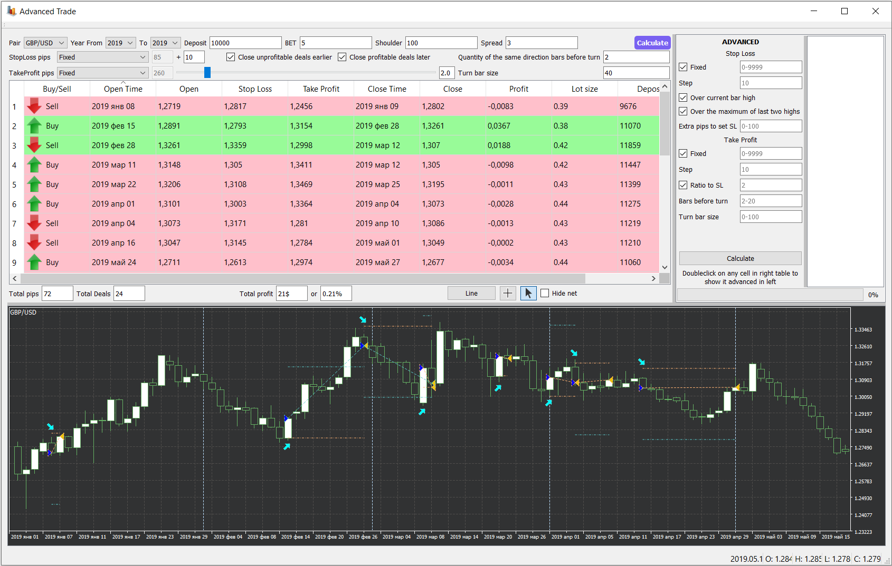

# StockQuotesAnalyzer

The application helps to analyze the reversal technique on the historical data of the forex currencies

Easy start: Press "Calculate"
It will apply default data.

The main screen is divided into three blocks.

The upper left block is responsible for the specific current settings. 

The upper right block allows you to make a calculation using gaps and determine the best technique.

The lower block is a graphical representation of the movement of securities with a reflection of the inputs and outputs from the transaction.
